# [PHP] WEBSITE THƯƠNG MẠI ĐIỆN TỬ

## Introduction
Mục tiêu của việc xây dựng trang web này nhằm giúp cho các cửa hàng giảm thao tác trên excel, mang lại tính chính xác và hiệu quả cao trong công tác quản lý hoạt động kinh doanh. Và khách hàng có thể mua hàng trực tiếp từ xa thông qua mạng internet phổ biến, có thể dễ dàng tham khảo thông tin sản phẩm mình tìm, so sánh giá cả các mặt hàng và lựa chọn cho mình loại sản phẩm phù hợp nhu cầu của mình, giúp công việc mua sắm một cách nhanh chóng, tiện lợi, tiết kiệm thời gian, đáp ứng được nhu cầu thực tế. Hệ thống tìm kiếm dễ dàng, giao diện thân thiện. Chỉ cần đăng nhập vào hệ thống với tài khoản đã có (nếu khách hàng đã là hội viên của cửa hàng) hay chỉ cần vài thao tác đăng ký đơn giản là khách hàng có thể tự do chọn mua và tạo đơn đặt hàng tại hệ thống. Bên cạnh đó quản trị viên có thể quản lý sản phẩm, đơn hàng và thống kê doanh thu

Here is my PHP source code for e-commerce website . With my code: 

				-- user : admin
					nhanvienbanhang
						nhanviengiaohang
							nhanvienkho
								khach hang
									khach hang vang lai
				phân quyền mỗi user khác nhau
				
		-- các chức năng;
				- thêm, xoa, sửa thông tin
				- thông kê tổng doanh thu
				- xuất/in hóa đơn ban hàng, phiếu nhập/xuất kho
				- xử lý đơn hàng

## Giao Diện Người Dùng
output:

## Giao Diện Khách Mua Hàng Trên WebSite

  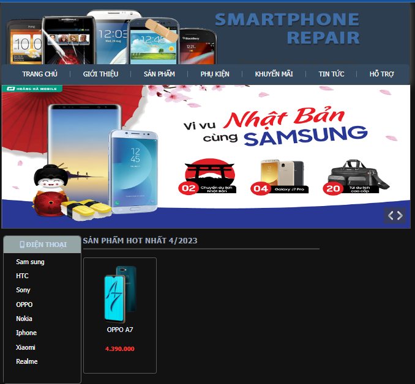 
  <i>Home</i>

  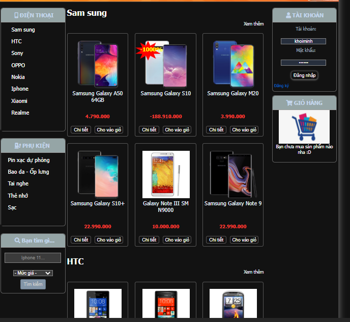 
  <i>Xem Sản Phẩm</i>

  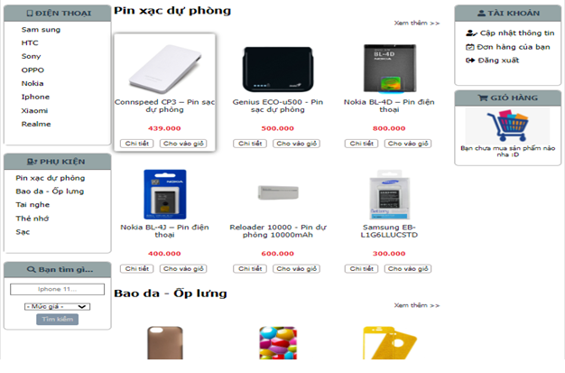 
  <i> Trang Phụ Kiện</i>

  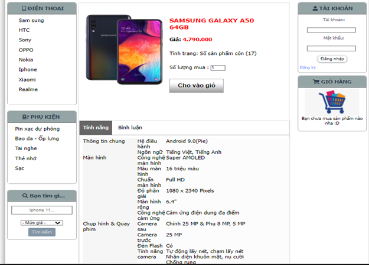 
  <i>Chi Tiết Sản Phẩm</i>

  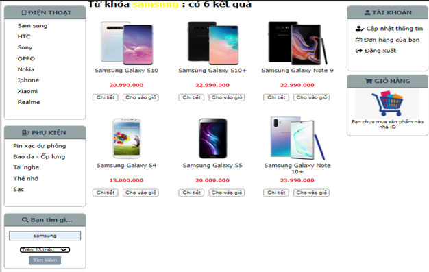 
  <i>Tìm Kiếm Sản Phẩm</i>

  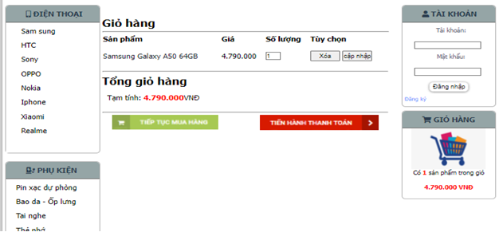 
  <i>Trang Giỏ Hàng</i>

  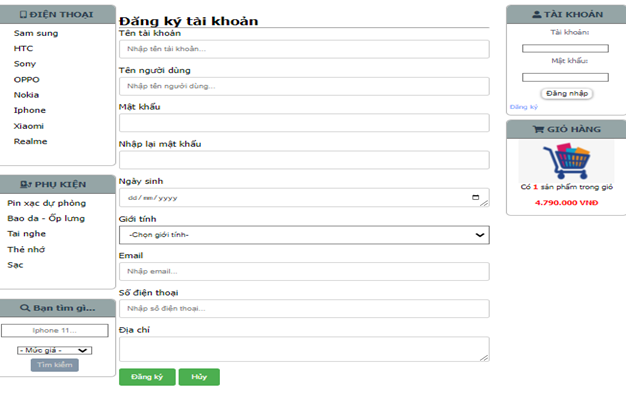 
  <i>Đăng Ký Thành Viên</i>

   
  <i>Thanh Toán</i>

  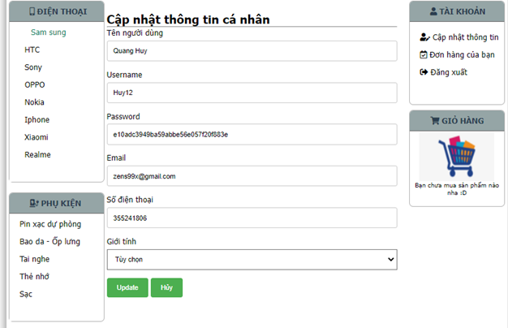 
  <i>Chỉnh Sửa Thông Tin Cá Nhân </i>

  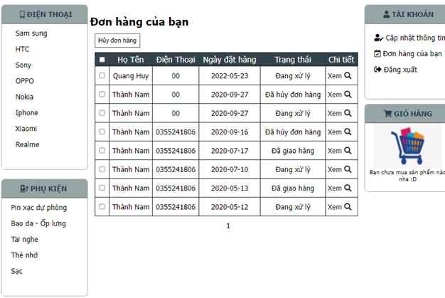 
  <i> Kiểm Tra Đơn Hàng </i>

## Trang ADMIN
Quản lý Bán Hàng, Và Quản Lý Sản Phẩm, Tin Tức:

  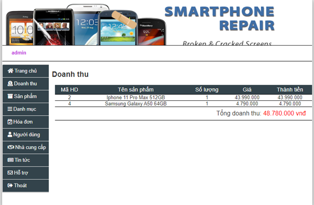 
  <i>Thống Kê Doanh Thu</i>

  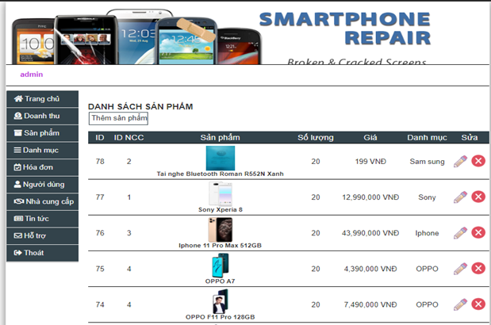 
  <i>Quản Lý Sản Phẩm</i>

  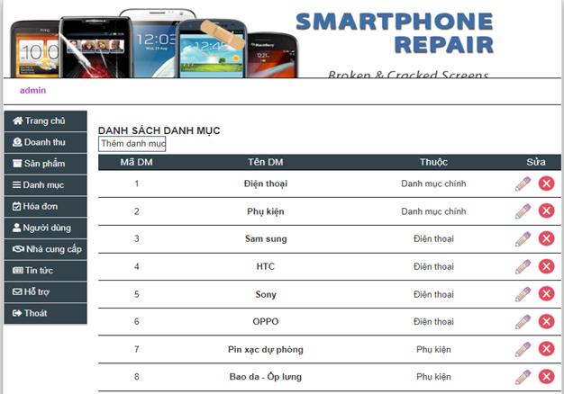 
  <i>Quản Lý Danh Mục</i>

  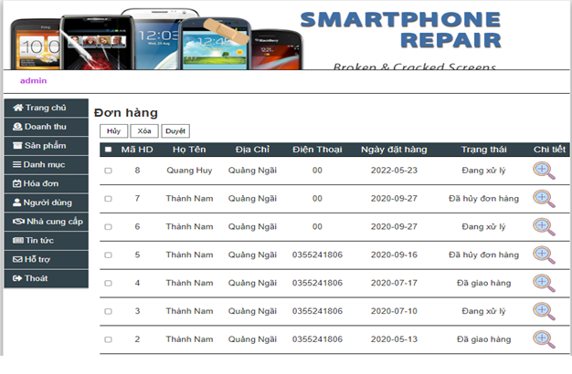 
  <i>Quản Lý Đơn Hàng Khách Đặt</i>

  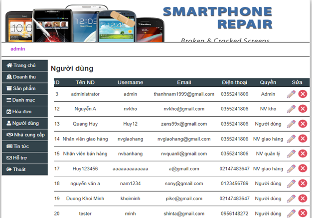 
  <i>Quản Lý Người Dùng</i>

  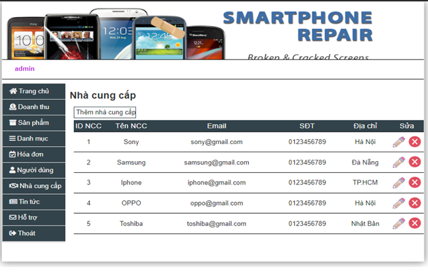 
  <i>Quản lý Hãng</i>

  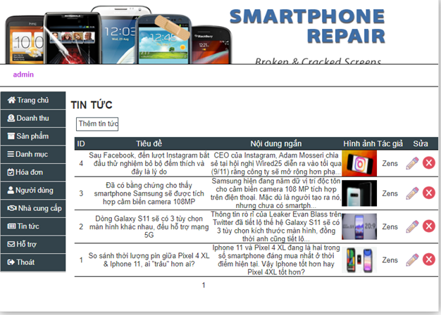 
  <i>Quản Lý Forum Tin Tức</i>

  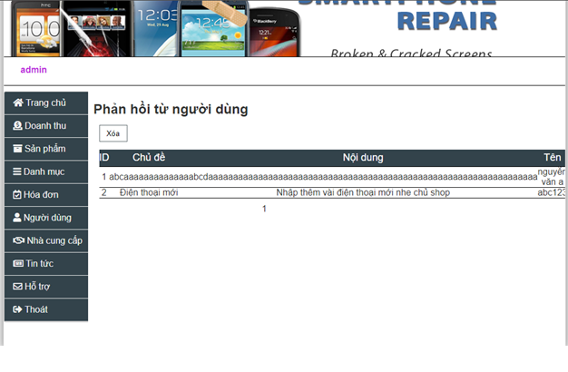 
  <i>Quản Lý Phản Hồi Người Dùng</i>

## technology used
* **PHP**
* **Javascript**
* **HTML/CSS** 
* **MySQL**

